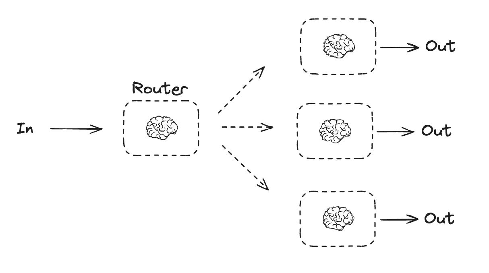

# AITutorial

Examples:
 * [Chatbot](./ChatBot/README.md), connects Google LLM with a min Web Interface.
 * [DynamicOrderManagementSystem](./DynamicOrderManagementSystem/README.md), connects Google LLM with query to SQL  Database. 
 * [WebSocket](./WebSocket/README.md), connects Web HTML / Javascript to Python Websocket

## LangGraph Agent Architecture
 
 References:
  * [Agent architectures](https://langchain-ai.github.io/langgraph/concepts/agentic_concepts/)
  * [Langchain Academy](https://github.com/langchain-ai/langchain-academy/blob/main/module-0/basics.ipynb)

 Concepts:
  * Router
  * Structured Output
  * Tool Calling Agent
  * Tool Calling
  * Memory
  * Planning
  * Human in the loop
  * Parallelization
  * Subgraphs
  * Reflexions
 
 Reference: 
 
 Agent Types
 
 
 Agent Workflow
 
 
 Augmented LLM
 
 
 Prompt Chaining
 
 
 Parallelization
 
 
 Routing
 
 
 Agent
 
 
 Worker
 
 
 Evaluator Optimizer